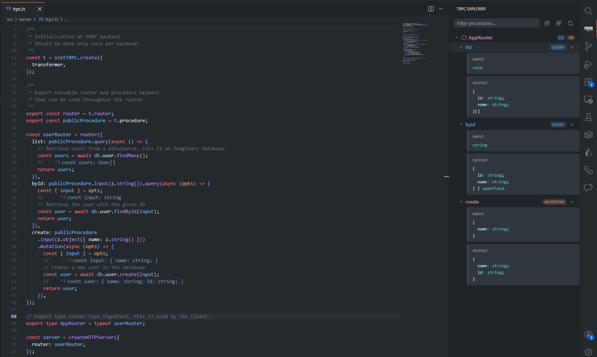

# tRPC Explorer

[](LICENSE)
[](https://code.visualstudio.com/)

[Extension Marketplace]: https://marketplace.visualstudio.com/items?itemName=gregcorp.tRPC-explorer
[Repository]: https://github.com/gregcorp/vscode-tRPC-explorer
[Report Issue]: https://github.com/gregcorp/vscode-tRPC-explorer/issues/new

[Extension Marketplace] • [Repository] • [Report Issue]

A Visual Studio Code extension that automatically discovers your tRPC `AppRouter` and shows all your routers, queries, mutations, and subscriptions in an interactive sidebar panel.

Please note that this extension is unofficial and is not affiliated with the tRPC team.

<div style="text-align: center;">


</div>



## Introduction

This project is about creating an ui to visualise your [tRPC](https://trpc.io/) api. Here is their own description of tRPC:

> tRPC allows you to easily build & consume fully typesafe APIs without schemas or code generation.

I created this extension, because I wanted to learn how to create vscode extensions. During its creation, I encountered many problems, which I describe in [How It Works](docs/HOW_IT_WORKS.md).

## Requirements

- VS Code **≥ 1.109.0**
- A project that uses [tRPC](https://trpc.io/) with an exported `AppRouter` type, that's within a \*.ts file :
  ```ts
  export type AppRouter = typeof appRouter;
  ```

## Installation

Search for **tRPC Explorer** in the VS Code Extensions Marketplace, or install from the command line:

```bash
code --install-extension trpc-explorer
```

## Development

```bash
pnpm install

# for development usage
pnpm watch

# lint
pnpm lint
pnpm check-types

# build for production
pnpm package
```

Press **F5** in VS Code to launch an Extension Development Host with the extension loaded.

## Submitting an Issue

If you encounter any issues or have suggestions for improvements, please [submit an issue](https://github.com/gregcorp/vscode-tRPC-explorer/issues/new).

If you have a problem, make sure to send a copy of the logs, found in the "Output" panel under "tRPC Explorer".

## License

This project is licensed under the [MIT License](LICENSE).

## Limitations

- The type variable router has to be called `AppRouter`. Might in the future add paterns, but in every tRPC examples, it's called `AppRouter`, so it seemed like a good default.
- It uses a global regex of `**/*.ts` to find candidate files, which might not be the best way.
- It for the moment only support Zod schemas, more might be added later.

## Test Project

A test project is available in the `example` folder. It contains a simple tRPC server. To run it, execute the following commands:

```bash
cd example
pnpm install
```

You can then use the extension in the root of the project, and it should automatically discover the `AppRouter` and show the API in the sidebar.

## How It Works

All technical details are documented in [docs/HOW_IT_WORKS.md](docs/HOW_IT_WORKS.md).
